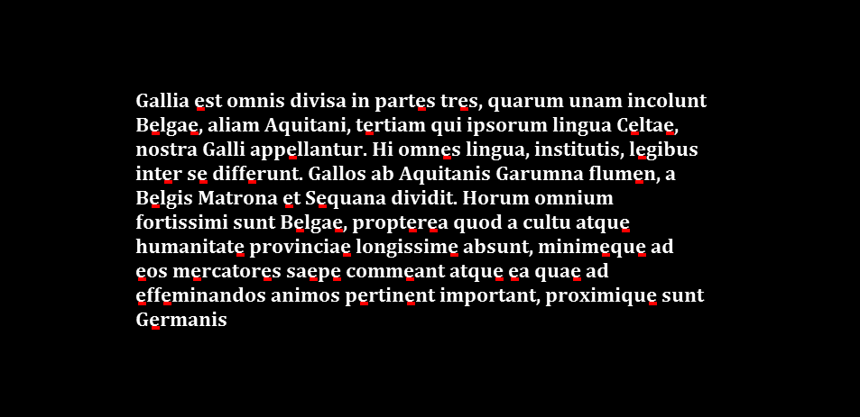

<font size="6">
Pattern finding on images
</font>

<br>
<font size="1">
<a href="README.md" style="color: purple">CLICK HERE TO RETURN TO THE MAIN PAGE</a>
</font>


Given whole image and a pattern, we want to mark the pattern on the image.

For example we have the following image:


And lets say our pattern will be letter "e":


These are the steps I followed to create a program that finds the pattern in the image:
<ol>
<li>Invert and grayscale image and pattern</li>
<li>Using DFT show module and phase of image</li>
<li>Using DFT and the formula: C=real(ifft2(fft2(galia).*fft2(rot90(imp,2),h,w))); to calculate corrlation between image and pattern</li>
<li>Overlay given image and found elements on one image</li>
</ol> 

<br>
<br>
<br>

Importing necessary libraries:
```python
import numpy as np
import numpy.fft as fft
from PIL import Image
from numpy import rot90
import os
```


__1. Invert and grayscale image and pattern:__

```python
def invert_image(image):
    return Image.eval(image, lambda x: 255 - x)

def save_image(image, filename):
    image.save(filename)

def to_gray(image):
    return image.convert('L')

def to_rgb(image):
    return image.convert('RGB')
```
Image after inverting and grayscaling:


Pattern after inverting and grayscaling:


__2. Using DFT to show module and phase of image:__

```python
def dft(image):
    image_arr = np.asarray(image)
    dft_arr = fft.fft2(image_arr)

    #np.abs oblicza modul liczby zespolonej (pierwiastek z sumy kwadratow czesci rzeczywistej i urojonej)
    #np.log oblicza logarytm z liczby bo roznice miedzy modulami sa duze
    module = np.log(np.abs(dft_arr))
    #skalujemy modul do przedzialu [0, 255]
    module /= module.max()
    module = 255 * module

    module = module.astype(np.uint8)
    module = Image.fromarray(module)


    #np.angle oblicza faze (kat) liczby zespolonej
    # dodajemy pi, aby faza byla z przedzialu [0, 2*pi] a nie [-pi, pi]
    phase = (np.angle(dft_arr) + np.pi)
    #skalujemy faze do przedzialu [0, 255]
    phase *= 255 / (2 * np.pi)

    phase = phase.astype(np.uint8)
    phase = Image.fromarray(phase)

    return module, phase
```

Module of image:


Phase of image:


__3. Calculate correlation between image and pattern:__

C=real(ifft2(fft2(galia).*fft2(rot90(imp,2),h,w)))

```python
def calculate_correlation(image1,image2,norm = True):
    image1_arr = np.asarray(image1)
    image2_arr = np.asarray(image2)

    h,w = image1_arr.shape

    #rot90(imp,2)
    rotated = rot90(image2_arr, 2)

    #fft(galia)
    tmp1 = fft.fft2(image1_arr)
    #fft(rot90(imp,2),h,w)
    tmp2 = fft.fft2(rotated,(h,w))


    #ifft2(fft2(galia).*fft2(rot90(imp,2),h,w))
    result = fft.ifft2(tmp1*tmp2)

    #leave only real values
    result = np.real(result)

    if norm:
        result /= np.max(np.abs(result))
    
    return result
```

__4. Highlight found elements on image:__


Percentage is a threshold that determines how much correlation between image and pattern is needed to mark the element on the image.

```python
def highlight_correlated_elements(image_arr, correlation, percentage,color):
    elements = []
    w,h = correlation.shape

    for i in range(w):
        for j in range(h):
            if correlation[i,j] > percentage:
                elements.append((i,j))

    result = image_arr.copy()

    for y, x in elements:
        for height in range(0, 4):
            for width in range(-9, 0):
                    result[y + height, x + width] = color

    result_image = Image.fromarray(result)
    return result_image
```

__Final function that combines all the steps:__

```python
def find_pattern(folder_path,image_path, pattern_path, percentage,color):

    A = Image.open(image_path)

    if folder_path == 'images/fishes':
        A_gray = to_gray(A)
        A_color = to_rgb(A)
    else:
        A_inv = invert_image(A)
        A_gray = to_gray(A_inv)
        A_color = to_rgb(A_gray)
        

    module,phase = dft(A_gray)    

    save_image(module, os.path.join(folder_path, 'module.png'))
    save_image(phase, os.path.join(folder_path, 'phase.png'))

    if folder_path == 'images/fishes':
        pattern = Image.open(pattern_path)
        pattern_gray = to_gray(pattern)
    else:
        pattern = Image.open(pattern_path)
        pattern_inv = invert_image(pattern)
        pattern_gray = to_gray(pattern_inv)
        

    save_image(pattern_gray, os.path.join(folder_path, 'pattern_gray.png'))

    correlation = calculate_correlation(A_gray, pattern_gray)
    save_correlation(correlation, os.path.join(folder_path, 'correlation.png'))

    highlighted = highlight_correlated_elements(np.asarray(A_color), correlation,percentage,color)
    save_image(highlighted, os.path.join(folder_path, 'highlighted.png'))
```

Results:
```python
find_pattern('images/galia','images/galia/galia.png','images/galia/e.png',0.80,RED)
```


As we can see, the letter "e" was found on the image, but our code also found some other elements that are not the letter "e". This is probably because the percetange is too low.

Let's try higher percentage value:
```python
find_pattern('images/galia','images/galia/galia.png','images/galia/e.png',0.95,RED)
```



__IT WORKED! Now only the letter "e" was found on the image.__

<br>
<br>
<br>
<br>

__FINDING NEMO:__

Now let's suppose we have lost our fish in the ocean and we want to find it. 
Fortunately we have the photo of our fish:


Let's try to find it in the ocean:


```python
find_pattern('images/fishes','images/fishes/fishes.png','images/fishes/fish1_color.png',0.7,RED)
```

Not good enough - we don't want to mistake our fish with other ones.
```python
find_pattern('images/fishes','images/fishes/fishes.png','images/fishes/fish1_color.png',0.95,RED)
```


__WE FOUND NEMO!__


<font size="1">
<a href="README.md" style="color: purple">CLICK HERE TO RETURN TO THE MAIN PAGE</a>
</font>