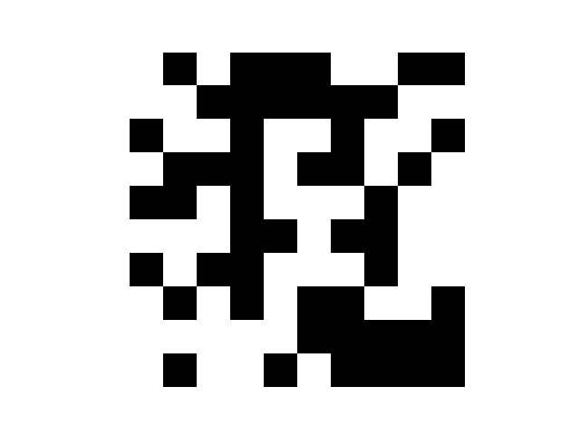

Generating binary images using simulated annealing

 

<a href="README.md" style="color: purple">CLICK HERE TO RETURN TO SIMULATED ANNEALING PAGE</a>

We will consider 3 types of energy functions for generating binary images:
 

<ol>
<li>Counting the four neighbours of pixel with the same colour</li>
<li>Counting the eight neighbours of pixel with the same colour</li>
<li>Counting the 2-corner neighbours of pixel with the same colour</li>
<li>Counting the 4-corner neighbours of pixel with the same colour</li>
</ol> 

Multiple highs and lows in the energy and temperature plot are due to the reheat functionality. 

 

**Using the four-neighbours energy function:**

This is the energy plot for the solution:

Temperature plot for the solution:

Final solution:

**Using the eight-neighbours energy function:**

This is the energy plot for the solution:

Temperature plot for the solution:

Final solution:

**Using the 2-corners energy function for smaller img:**

This is the energy plot for the solution:

Temperature plot for the solution:

Final solution:

**Using the 2-corners energy function for bigger img:**

This is the energy plot for the solution:

Temperature plot for the solution:

Final solution:

**Using the 4-corners energy function for bigger img:**

This is the energy plot for the solution:

Temperature plot for the solution:

Final solution:

<a href="README.md" style="color: purple">CLICK HERE TO RETURN TO SIMULATED ANNEALING PAGE</a>
