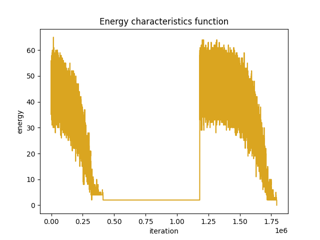
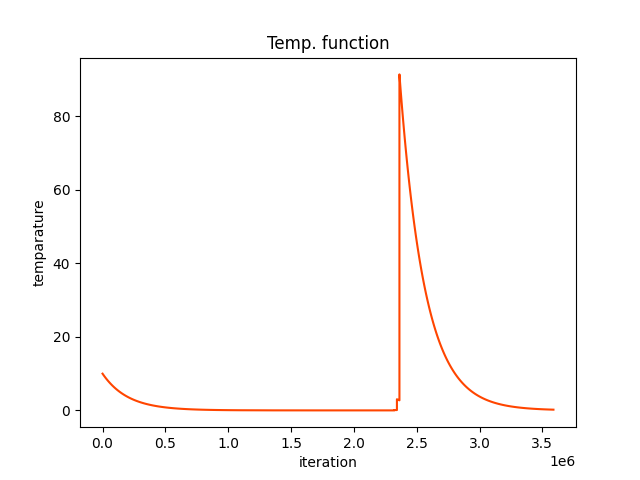

<font size="6">
Sudoku Solver
</font>
<br>
<font size="2">
<a href="README.md" style="color: purple">CLICK HERE TO RETURN TO SIMULATED ANNEALING PAGE</a>
</font>


In this notebook I implemented the simulated annealing algorithm to solve the sudoku puzzle.  The puzzle starts with some cells filled in with digits, and the goal is to fill in the remaining cells.

Algorithm starts by randomly filling in the empty cells with digits ensuring that there aren't any conflicts in each 3x3 grid. 
<br>
Calculating energy:
It calculates the energy of the current solution by counting the number of conflicts in the rows, columns. 
<br>
Generating neighbour state:
The algorithm randomly selects a 3x3 grid and 2 digits in it, checks if the digits aren't the ones given in init sudoku board and if not it switches them.
<br>
Multiple highs and lows in the energy and temperature plot are due to the reheat functionality. 
<br>
Given to-solve sudoku looks like that:
```python
3xxxxxx2x
xxxxxx964
2x8xxxx5x
17xx8xxxx
xxx2xxxx7
xxxx5x4xx
xx9xxxxxx
xx6xx4xx5
x2x9x6xxx
```
Where x is a cell to fill in.

Example of randomly filled sudoku board:
```python
[3, 7, 5, 5, 8, 2, 1, 2, 3]
[9, 4, 1, 7, 6, 3, 9, 6, 4]
[2, 6, 8, 1, 9, 4, 7, 5, 8]
[1, 7, 2, 7, 8, 4, 2, 5, 8]
[6, 9, 8, 2, 6, 1, 6, 1, 7]
[4, 3, 5, 3, 5, 9, 4, 9, 3]
[5, 3, 9, 7, 8, 2, 8, 3, 9]
[4, 7, 6, 5, 1, 4, 7, 1, 5]
[8, 2, 1, 9, 3, 6, 6, 4, 2]

With energy equals to: 49
```

Energy plot for the solution:



Temperature plot for the solution:



Solution:
```python
[3, 6, 4, 1, 9, 5, 7, 2, 8]
[7, 5, 1, 8, 3, 2, 9, 6, 4]
[2, 9, 8, 6, 4, 7, 3, 5, 1]
[1, 7, 5, 4, 8, 9, 6, 3, 2]
[9, 4, 3, 2, 6, 1, 5, 8, 7]
[6, 8, 2, 7, 5, 3, 4, 1, 9]
[4, 3, 9, 5, 2, 8, 1, 7, 6]
[8, 1, 6, 3, 7, 4, 2, 9, 5]
[5, 2, 7, 9, 1, 6, 8, 4, 3]

With energy equals to: 0
```

<font size="2">
<a href="README.md" style="color: purple">CLICK HERE TO RETURN TO SIMULATED ANNEALING PAGE</a>
</font>